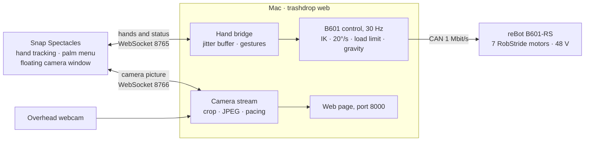

<div align="center">

# TrashDrop

**Pinch the air, and a robot arm follows your hand.**

This repository holds two things. The first is teleoperation of a reBot B601-RS arm
through Snap Spectacles. The second is a cell in which two SO-101 arms sort trash by
material. Both were built at the Alien Bazaar 2026 hackathon.


[Gestures](#gestures) · [How it works](#how-it-works) · [Quick start](#quick-start) ·
[The sorting cell](#the-sorting-cell) · [Documentation](#documentation)

</div>

---

## What it is

The operator wears Snap Spectacles, pinches thumb and index finger together in mid-air and
moves the hand. The arm's jaw moves with it. Touching the thumb with one of the other fingers
turns the jaw, tilts it, or opens and closes the gripper. The overhead camera's picture floats
in the glasses as a window that can be moved around. Turning a palm up brings up a menu.

| | |
|---|---|
| **Spectacles teleoperation**<br>*the current focus* | A Lens Studio Lens streams both hands to a Mac. The Mac turns gestures into motion of a central **reBot B601-RS** arm, which has six axes and a gripper and is driven by RobStride motors on a CAN bus. Inverse kinematics (IK) plans each step, and a speed limit and a load limit bound it. The same Lens drove the two SO-101 arms before the B601 arrived. |
| **Sorting cell** | Two **SO-101** arms face each other across a shared pick zone. They sort waste into `plastic`, `paper` and `metal` bins, and anything unsure goes to `mixed`. The cell has an overhead camera, a material classifier, a MuJoCo model of the whole cell, and an open intake API for other teams' robots. |

## Gestures

Either hand can drive; whichever hand starts a gesture drives it. When you let go of any
gesture, the arm holds where it is.

| Gesture | What the arm does |
|---|---|
| **Thumb + index** pinch, then move the hand | The jaw follows the hand in 3D, starting from wherever the jaw is when the pinch begins. Pinch again anywhere to go further. |
| **Thumb + middle** touch, then move sideways | The jaw turns about the vertical without moving. Moving right turns it clockwise, seen from above; the rate is 5° per cm. |
| **Thumb + ring** touch, then move sideways | The jaw tilts between level and pointing straight down. Right tilts it down, left tilts it up; the rate is 5° per cm. |
| **Thumb + pinky** touch, then move sideways | The gripper moves: right closes it, left opens it, a tenth of its travel per cm. It stops as soon as you let go. |
| **Palm up** | The menu opens. **B601** switches the arm on, **NEUTRAL** parks it and switches it off, **EXIT UI** closes the glasses UI. |

There is no calibration step. "Forward" is the direction you are looking in when you pinch.

## How it works



Both sockets reach the glasses over their USB cable through `adb reverse`. The Lens itself is
made of three scripts: `HandStream.ts` sends the hands, `SpectaclesUI.ts` draws the menu and
the status, and `WebcamView.ts` shows the camera picture.

The design choices below are what make the arm steerable by hand.

- **Clutch-relative mapping.** This works like a VR controller's grip button. The pinch grabs
  the jaw, the jaw moves as far as the hand has moved since the pinch began, and letting go
  leaves the arm where it is. You can grab again anywhere, so the limit is the arm's reach, not
  yours.
- **Smooth motion from bunched packets.** Hand frames reach the Mac in bunches, about three
  every 100 ms. A jitter buffer plays them back evenly on the glasses' own clock.
- **Position before orientation.** The IK is damped least squares, computed with
  [pinocchio](https://github.com/stack-of-tasks/pinocchio) on the vendor's URDF. The jaw's
  position always comes first. Its heading and tilt are pursued only with the freedom the
  position leaves, so a hard-to-reach angle never pulls the jaw off course. If a joint would
  cross its limit, it is frozen and the step is solved again without it.
- **One speed limit.** No joint moves faster than 20°/s. The whole step is scaled down
  together rather than clipped joint by joint, so the jaw keeps its path.
- **A load limit.** Before each step, a gravity model predicts every joint's torque. Joints
  J1–J3 stay under 9 N·m (the RS06 motor is rated for 11) and J4–J6 under 3.5 N·m. A move
  that would exceed the limit is refused. A sideways move slides along the limit instead of
  stopping.
- **Gravity feed-forward.** Torque from the vendor's gravity model is added to each command,
  faded in over one second.
- **Faults hold the arm; they never let go.** If a CAN reply is late, or a joint falls 5°
  behind its target, the arm holds where it is. Only parking or a second Ctrl+C switches the
  motors off.

<details>
<summary><b>What went wrong on the real arm, and what changed</b></summary>

- **The arm fell twice.** The first time, a feedback read timed out and the fault handler of
  that version disabled every motor. Faults now hold the arm instead. The second time, J2
  carried 10–13 N·m for more than three minutes at 60 cm reach, and its overload protection
  went limp. That fall is why the load limit exists.
- **The arm leaned back instead of reaching forward.** At first the jaw's tilt followed the
  pitch of the hand. Tilt became a gesture of its own, and the IK now puts position first.
- **Tuning ran on the wrong camera.** For an afternoon, camera settings went to the USB
  webcam while the frames came from the laptop's built-in camera. `--camera auto` now zooms
  the webcam for a moment and picks the stream that zooms with it.
- **The simulation's score could not fail.** An early simulation teleported each item into
  its bin and reported 5/5. Items are now released from where the jaw really is, and physics
  decides where they land.

</details>

## Quick start

Everything runs through [uv](https://docs.astral.sh/uv/). Dependencies live in the project's
own `.venv`, and nothing is installed system-wide.

### Drive the B601 from the glasses

You need:

- **Snap Spectacles (2024)** on a USB cable, with `adb` on the `PATH`. The Mac forwards ports
  8765 and 8766 to the glasses with `adb reverse`.
- **[Lens Studio 5.15.4](https://ar.snap.com/lens-studio)**, with the Lens project in
  `spectacles/spectacles/` open.
- **For the live arm:** Seeed's
  [reBot SDK](https://github.com/Seeed-Projects/reBotArm_control_py), installed in its own
  Python 3.11 environment with `motorbridge`, `pinocchio` and OpenCV. On macOS you also need
  the MacCAN PCBUSB library for the CAN adapter. The default paths for both are in
  `trashdrop/b601_motor.py`. To use other paths, set `TRASHDROP_B601_SDK` and
  `TRASHDROP_B601_PCBUSB`.

```bash
uv sync --inexact --extra rig                 # numpy and OpenCV: camera, web page, glasses bridge
uv run trashdrop web --b601 --dry-run --open  # glasses UI and video only; the arm never moves
uv run trashdrop web --b601 --open            # live arm: restarts itself inside the SDK's environment
```

Then:

1. In Lens Studio, press **Preview Lens** to send the Lens to the glasses.
2. On the web page, press **Enter Spectacles UI**.
3. In the glasses, turn a palm up and press **B601**. Pinch, then move your hand.

> [!WARNING]
> Stand next to the 48 V switch the first time. The arm has no collision detection and no
> workspace fence, so only the operator keeps the jaw off the table. **NEUTRAL** drives the
> arm slowly to its measured rest pose (`b601_park.toml`) and then switches the motors off.
> The first Ctrl+C holds the arm; a second one switches the motors off, so support the arm
> before pressing it.

To drive the two SO-101 arms instead, run `uv run trashdrop web --open` and choose **MANUAL**
in the palm menu. Each hand drives the arm on its side. A thumb and index pinch drags that
arm's jaw, thumb and middle turn it, and thumb and pinky open or close it. The operator's
guide is [spectacles/README.md](spectacles/README.md).

### Simulation and tests

```bash
python scripts/bootstrap_model.py           # SO-ARM100 model from MuJoCo Menagerie, ~7 MB sparse checkout
uv sync --extra simulation --group dev

uv run trashdrop probe                      # is every bin and pick-zone corner reachable?
uv run trashdrop sim                        # full two-arm sort, ~7 s, writes out/
uv run python -m pytest tests/ -q           # the test suite
uv run mjpython -m trashdrop sim --viewer   # live viewer; macOS needs mjpython, plain python fails
```

## The sorting cell

Two SO-101 arms face each other across a shared pick zone. The overhead camera finds each
item and a classifier names its material. The arm on that side then picks the item up and
drops it into `plastic`, `paper` or `metal`, and anything uncertain goes to `mixed`. Another
team's robot delivers the trash through an [open intake API](docs/API.md). The team's
success criterion is zero sorting errors, so "not sure" is always an allowed answer.

```
uv run trashdrop sim
...
cycle 0: 3 item(s) in the pick zone
  paper    at (+0.062, -0.222) -> front -> bin paper
    above bin, tcp error 2 mm
cycle 1: 2 item(s) in the pick zone
  plastic  at (+0.010, -0.274) -> back  -> bin plastic
...
sorted correctly: 3/3  (picks 3, misses 0)
```

The browser version shows the overhead stream with the zone, the item and the grasp drawn
over it. It has a button for every step. Auto sort keeps taking whatever is tossed into the
zone until you press STOP (or Esc on the page). The arms' speeds and the pick's settings can
be changed there too:

```bash
uv run trashdrop web                     # then open http://localhost:8000 (a phone too, with --host)
uv run trashdrop web --demo              # no camera or arms: out/'s pictures and pretend arms
```

<details>
<summary><b>The real arms and cameras, from the terminal</b></summary>

`rig.toml` says which USB device is which.

```bash
uv sync --inexact --extra rig --extra arm
uv run trashdrop rig identify            # move each joint of each arm by hand when asked
uv run trashdrop rig check               # every arm and camera answering, a snapshot each
uv run trashdrop rig touch left --tape   # the fixed fingertip on each taped corner it reaches
uv run trashdrop camera tape             # click the same corners in the overhead picture
uv run trashdrop rig roll left           # where the wrist roll's zero really is (jaw across, not along)
uv run trashdrop pick --dry-run          # find an item, plan, hover over it; drop --dry-run to grasp
uv run trashdrop pick                    # plastic and metal go left, paper right; unsure stays put
uv run trashdrop arm status              # both arms, every joint in degrees; moves nothing
uv run trashdrop arm save left rest      # pose the limp arm by hand, record it in poses.toml
uv run trashdrop arm go left rest        # play it back slowly (max_speed in rig.toml)
uv run trashdrop arm first --speed 12    # releases both for hand posing; Enter -> both together to organizers_first
uv run trashdrop arm together crab_start # both arms to one pose, grippers clamping what they hold between them
uv run trashdrop dance                   # crab rave with it: slow; --bpm 125 --rock 8 --sway 6 for the real thing
uv run trashdrop arm jog left wrist_flex 10
uv run trashdrop arm gripper left open   # or close, or a percent
uv run trashdrop arm relax left          # limp again -- hold it if it is in the air
```

</details>

<details>
<summary><b>The material classifier and the dataset</b></summary>

Sorting by material needs the classifier, installed once per machine. The model is 350 MB
and is not in git; the training environment has CLIP's weights.

```bash
(cd training && uv run python export.py) # writes models/material/: CLIP as ONNX, and its head
uv sync --inexact --extra classifier     # onnxruntime for the cell
```

Shooting dataset photos needs no MuJoCo:

```bash
uv sync --extra dataset
uv run trashdrop capture --session 2026-09-20-kitchen --category plastic --object-id bottle_01
uv run trashdrop autolabel --session 2026-09-20-kitchen
uv run trashdrop review --session 2026-09-20-kitchen
```

Nothing heavy is installed by default. There is no ROS and no training stack, and `lerobot`
is installed only if you ask for it with `uv sync --extra teleop`. Models are trained
elsewhere, exported to ONNX, and loaded through `perception/classifier.py`.

</details>

### What the simulation proves, and what it does not

The simulation proves reachability, transfers, the layout, the serialisation of two arms
sharing one volume, and the scoring. Items are released from where the tool actually is, and
physics decides where they land.

It does **not** prove grasping. The grasp is kinematic, so nothing in the simulation predicts
whether a real gripper holds a crushed can. It does not prove perception either:
`perception/color.py` reads back the colour the simulator itself assigned, and it exists only
to exercise the motion stack. Real numbers for both have to come from hardware and from our
own crops.

## Repository layout

| Path | What is there |
|---|---|
| `trashdrop/b601.py` | Gestures to jaw motion for the B601: drag, turn, tilt, grip |
| `trashdrop/b601_motor.py` | The B601 driver: IK, speed and load limits, gravity feed-forward, parking |
| `trashdrop/b601_glasses.py` | Glasses-to-B601 bridge: control loop, telemetry, recordings in `out/spectacles/` |
| `trashdrop/spectacles.py` | Hand WebSocket, jitter buffer, SO-101 pinch and joystick control, video pacing |
| `trashdrop/web/` | The browser page; owns the glasses' sockets and the camera stream |
| `spectacles/spectacles/` | Lens Studio 5.15.4 project: `HandStream.ts`, `SpectaclesUI.ts`, `WebcamView.ts` |
| `trashdrop/station.py` | All cell geometry as data. Change the numbers here, then run `probe` |
| `trashdrop/planning.py` | Assignment by material; anything uncertain goes to `mixed` |
| `trashdrop/control.py` | Per-arm IK for the SO-101. `send()` is the hardware seam |
| `trashdrop/perception/` | Class-agnostic detector and crop classifier; ArUco homography |
| `trashdrop/dataset/` | Capture on the rig, autolabel, review; TACO and TrashNet indexers |
| `trashdrop/simulator.py` | The MuJoCo cell: stepping, grasp, scoring |
| `trashdrop/api.py` | Open intake API that other teams' robots call. Standard library only |
| `training/` | Material classifier: CLIP embeddings, a head, export to ONNX |
| `b601_park.toml` | The B601's measured rest pose and gripper travel |

## Documentation

| Document | What is in it |
|---|---|
| [AGENTS.md](AGENTS.md) | Architecture, module layers and the invariants that must not break. Start here before changing code. |
| [docs/SPECTACLES.md](docs/SPECTACLES.md) | Glasses teleoperation in full: the numbers and where they came from, Lens Studio notes, the B601 commissioning log |
| [spectacles/README.md](spectacles/README.md) | The operator's guide to the Lens and the gestures |
| [docs/API.md](docs/API.md) | The open intake API. Give this to any team whose robot delivers trash to us. |
| [docs/DATASET.md](docs/DATASET.md) | How to shoot the dataset so that nobody draws a bounding box |
| [docs/CAMERA.md](docs/CAMERA.md) | Locking focus and white balance in `camera.toml`, and why that needs sudo on macOS |
| [docs/GRASPING.md](docs/GRASPING.md) | What the kinematic grasp proves and what it does not |
| [docs/APPROACH.md](docs/APPROACH.md) | Why the cell uses classic CV and IK rather than a learned policy, and where a policy would still help |
| [docs/CALIBRATION.md](docs/CALIBRATION.md) | The real table, ArUco markers, and using a phone as the camera |
| [docs/ARCHITECTURE.md](docs/ARCHITECTURE.md) | Layout diagram, data flow, motion sequence, frames |

## Acknowledgements

- [Seeed Studio](https://wiki.seeedstudio.com/rebot_b601_rs_getting_started/) for the reBot
  B601-RS, its [Python SDK](https://github.com/Seeed-Projects/reBotArm_control_py) and its
  URDF.
- [TheRobotStudio](https://github.com/TheRobotStudio/SO-ARM100) for the SO-101 arm, and
  [MuJoCo Menagerie](https://github.com/google-deepmind/mujoco_menagerie) for its model.
- [pinocchio](https://github.com/stack-of-tasks/pinocchio) for the B601's kinematics and
  gravity model, and [MuJoCo](https://mujoco.org) for the simulated cell.
- Snap's Spectacles Interaction Kit and UI Kit, on which the Lens is built.
